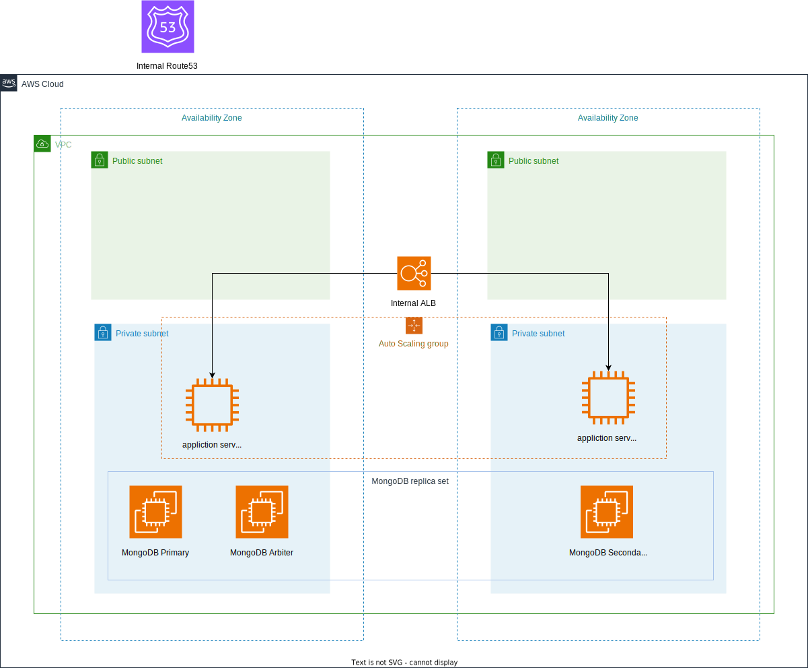

# Terraform & Terragrunt를 이용한 AWS Private 환경에서 MongoDB 자동 생성

이 저장소에서는 AWS 상에 MongoDB를 자동으로 생성하는 방법을 제공합니다. 제공된 아키텍처 다이어그램을 기반으로 Terraform 및 Terragrunt를 사용하여 코드를 작성했습니다.



## 디렉토리 구조
```markdown
root_module
│ terragrunt.hcl
│
├─ap-northeast-2
│ │ env.hcl
│ │ region.hcl
│ │
│ └─mongodb
│ ├─alb
│ │ terragrunt.hcl
│ │
│ ├─asg
│ │ terragrunt.hcl
│ │
│ ├─aws_data
│ │ data.tf
│ │ terragrunt.hcl
│ │
│ ├─ec2
│ │ terragrunt.hcl
│ │
│ ├─route53
│ │ terragrunt.hcl
│ │
│ └─sg
│ terragrunt.hcl
│
├─modules
│ └─sg
│ main.tf
│ outputs.tf
│ variables.tf
│
└─_envcommon
alb.hcl
asg.hcl
aws_data.hcl
ec2.hcl
route53.hcl
sg.hcl
```

## 📘 각 디렉토리의 역할

1. **root_module**: 최상위 디렉토리로, 전반적인 Terragrunt 설정 파일인 `terragrunt.hcl`이 위치합니다.

2. **ap-northeast-2**: 아시아 태평양 서울 리전의 설정 파일과 리소스 모듈이 저장된 디렉토리입니다.
   - `env.hcl`: 환경 설정 파일
   - `region.hcl`: 리전 설정 파일

3. **mongodb**: MongoDB 관련 리소스를 구성하는 디렉토리입니다.
   - 여기의 `hcl` 파일들은 공통 설정과 `_envcommon`의 동명의 `hcl` 파일의 설정을 불러와 실행합니다.
   - 실제 인프라의 설정은 `_envcommon` 디렉토리의 `hcl` 파일에서 이루어집니다.
   - **aws_data**: AWS의 기존 리소스 정보를 불러오는 역할을 합니다. `data.tf` 파일에서는 테라폼을 사용해 AWS에서 필요한 리소스 정보를 가져옵니다. 필요한 정보를 추가하거나 수정할 경우, 이 파일을 수정하면 됩니다.

4. **modules**: 재사용 가능한 Terraform 모듈이 저장된 디렉토리입니다.

5. **_envcommon**: 다양한 환경에 공통으로 적용되는 설정 파일들을 저장하는 디렉토리입니다. 여기에서 실제 인프라의 구성 설정이 이루어집니다.

## 🚀 실행 방법

1. **준비사항**: Terraform과 Terragrunt가 설치되어 있어야 합니다. 또한, AWS IAM 인증이 완료된 상태에서만 실행 가능합니다.

2. `ap-northeast-2` 디렉토리로 이동합니다.

3. 아래의 명령어를 순서대로 실행합니다:


```bash
terragrunt init
terragrunt plan
```

terragrunt plan을 실행한 후에 변경 사항을 반드시 확인하세요.

만약 변경 사항에 문제가 없다면, 아래의 명령어로 변경사항을 적용합니다:

```bash
terragrunt apply
```

